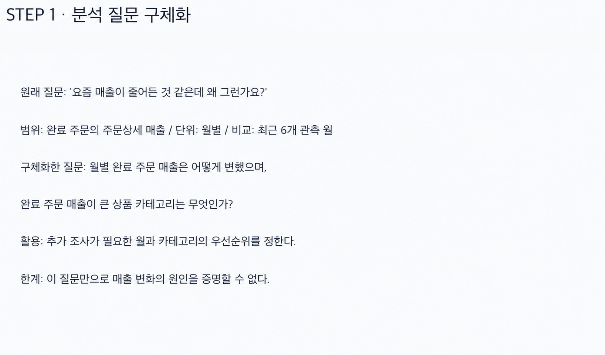
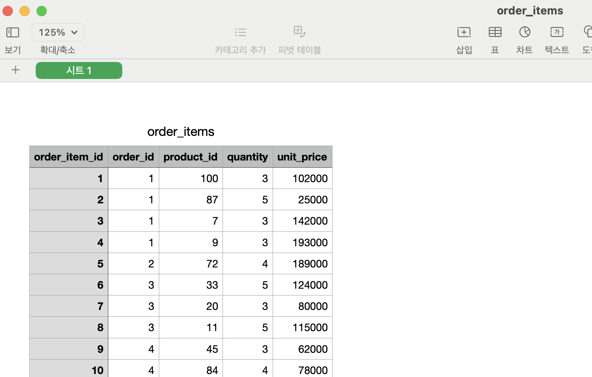
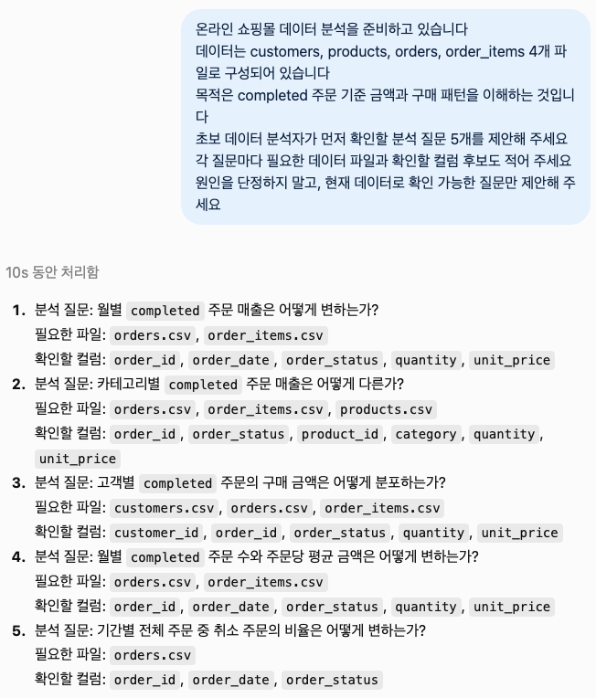
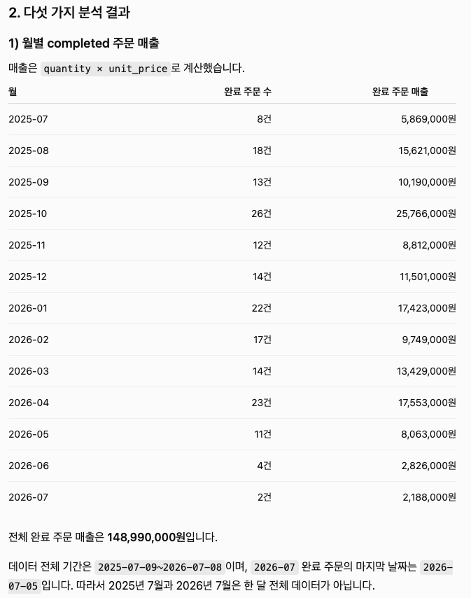
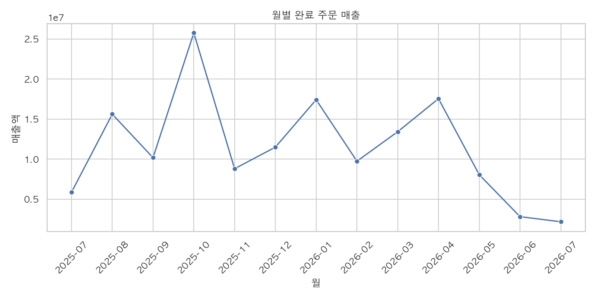

# Chapter 01 제출 답안. AI와 함께하는 데이터 분석의 시작

> 이 파일은 Chapter 01 실습 결과를 정리하여 제출하기 위한 학생용 템플릿입니다.
> 강사 저장소의 원본 템플릿을 직접 수정하지 말고, 자신의 PC에 복사한 뒤 작성합니다.

---

## 0. 제출 정보

- 이름: 장태원
- GitHub ID: pmsky1
- 개인 저장소명: `llm-data-analysis-study`
- 작성일: 2026-09-09
- 사용한 LLM: ChatGPT

### 최종 제출 URL

```text
https://github.com/pmsky1/llm-data-analysis-study/blob/main/chapter01/chapter01.md
```

---

## 1. 원래 업무 질문

### 내가 선택한 막연한 질문

```text
요즘 매출이 줄어든 것 같은데 왜 그런가요?
```

### 왜 이 질문이 모호하다고 생각했는가?

- 대상: 어떤 매출인지 정해져 있지 않음
- 기간: “요즘”이 언제인지 없음
- 기준: 완료 주문만 볼지 정해져 있지 않음
- 비교 방법: 무엇과 비교할지 없음
- 분석 목적: 원인을 찾는 것인지 현황을 보는 것인지 애매함

### 분석 가능한 질문으로 다시 작성

```text
최근 6개월동안의 completed 주문 매출은 어떻게 변했으며,
카테고리별 completed 주문 매출은 어떻게 다른가?
```

### 결과 관찰

완료 주문만 분석 범위에 포함함
월별 기준으로 비교함
매출은 주문상세의 수량 × 단가로 계산함

### 나의 해석과 판단

광고나 할인 정보는 현재 데이터에 없음
그래서 원인을 바로 말하기보다 매출 변화부터 보는 것이 맞다고 생각했음

### 업무·분석적 의미

매출이 많이 변한 달과 매출이 큰 카테고리를 먼저 찾을 수 있음

### 한계와 추가 확인 사항

이 질문만으로 매출이 줄어든 이유는 알 수 없음
할인, 재고, 광고, 방문자 수 정보가 더 필요함

### Evidence



---

## 2. 질문과 필요한 데이터 연결

### 필요한 데이터 파일

- [ ] `customers.csv`
- [x] `products.csv`
- [x] `orders.csv`
- [x] `order_items.csv`

### 필요한 컬럼 후보

| 파일              | 필요한 컬럼                                        | 필요한 이유                         |
| ----------------- | -------------------------------------------------- | ----------------------------------- |
| `orders.csv`      | `order_id`, `order_date`, `order_status`           | 완료 주문과 주문 날짜 확인에 필요함 |
| `order_items.csv` | `order_id`, `product_id`, `quantity`, `unit_price` | 매출 계산에 필요함                  |
| `products.csv`    | `product_id`, `category`                           | 카테고리별 비교에 필요함            |

### 데이터 연결 관계

```text
orders.order_id → order_items.order_id
order_items.product_id → products.product_id
```

### 결과 관찰

`orders.csv`는 300행
`order_items.csv`는 764행
`products.csv`는 100행
연결되지 않은 주문 ID와 상품 ID는 없음

### 나의 해석과 판단

월별/카테고리별 완료 주문 매출을 계산하는 데 필요한 정보는 있다고 판단함
이번 질문은 고객별 분석이 아니어서 `customers.csv`는 사용 안함

### 업무·분석적 의미

분석 전에 파일과 컬럼을 확인하면 없는 정보를 가지고 분석하는 실수를 줄일 수 있음

### 한계와 추가 확인 사항

결측값, 중복값, 환불 처리 기준은 더 확인해야 함

### Evidence



---

## 3. LLM에게 분석 질문 후보 요청

### 사용 목적

무엇부터 분석해야 할지 잘 몰라서 질문 후보를 받기 위해 사용함

### 사용한 Prompt

```text
온라인 쇼핑몰 데이터 분석을 준비하고 있습니다
데이터는 customers, products, orders, order_items 4개 파일로 구성되어 있습니다
목적은 completed 주문 기준 금액과 구매 패턴을 이해하는 것입니다
초보 데이터 분석자가 먼저 확인할 분석 질문 5개를 제안해 주세요
각 질문마다 필요한 데이터 파일과 확인할 컬럼 후보도 적어 주세요
원인을 단정하지 말고, 현재 데이터로 확인 가능한 질문만 제안해 주세요
```

### LLM 답변 요약

1. 월별 completed 주문 매출 변화 확인
2. 카테고리별 completed 주문 매출 비교
3. 고객별 구매 금액 분포 확인
4. 월별 주문 수와 주문당 평균 금액 확인
5. 기간별 취소 주문 비율 확인

### 결과 관찰

LLM이 월별, 카테고리별, 고객별 등 여러 방향의 질문을 제안함
실제 컬럼이 있는지는 답변만 보고 확인 불가

### 나의 해석과 판단

월별과 카테고리별 질문은 현재 파일로 해 볼 수 있어 보였음
그래도 실제 파일을 확인한 뒤에 사용해야 한다고 생각함

### 업무·분석적 의미

LLM은 처음 분석 방향을 생각할 때 도움이 됨
최종 질문은 내가 정해야 함

### 한계와 추가 확인 사항

컬럼 존재 여부와 계산 범위는 실제 데이터로 검증해야 함

### Evidence



---

## 4. LLM 제안 검증

LLM 제안 중 하나 이상을 선택해 검토합니다.

| 검증 항목                  | 확인 내용                                                                                           |
| -------------------------- | --------------------------------------------------------------------------------------------------- |
| 선택한 LLM 제안            | 월별 completed 주문 매출과 카테고리별 매출 비교                                                     |
| 필요한 파일                | `orders.csv`, `order_items.csv`, `products.csv` 있음                                                |
| 필요한 컬럼                | `order_date`, `order_status`, `order_id`, `product_id`, `quantity`, `unit_price`, `category` 확인함 |
| 계산 범위                  | 완료 주문만 사용하고 수량 × 단가를 계산함                                                           |
| 실제 데이터 확인 필요 여부 | 완료 주문 184건, 전체 주문 300건 확인함                                                             |
| 원인 단정 여부             | 원인은 현재 데이터로 단정하지 않음                                                                  |
| 최종 판단                  | 사용                                                                                                |

### 내가 수정한 내용

LLM 제안의 파일, 컬럼, 계산 범위를 실제 데이터와 비교해 확인함

### 결과 관찰

필요한 파일과 컬럼이 실제 데이터에 있음

### 나의 해석과 판단

매출은 `quantity × unit_price`로 계산하는 것이 맞다고 판단함

### 업무·분석적 의미

LLM 답변도 실제 파일과 컬럼을 확인한 뒤 사용해야 함

### 한계와 추가 확인 사항

7월 데이터가 한 달 전체인지 추가 확인 필요함

### Evidence



---

## 5. Prompt Log

- 사용 목적: 분석 질문 후보를 생각해 보기 위해 사용함
- 입력 Prompt 요약: 쇼핑몰 데이터로 확인할 수 있는 질문 5개 요청함
- LLM 답변 요약: 월별 매출, 카테고리별 매출, 고객 구매, 주문 금액, 취소 비율 제안함
- 실제 반영 여부: 월별·카테고리별 질문만 사용함
- 사람이 검증한 항목: 파일, 컬럼, 연결 키, 완료 주문 기준 확인함
- 사람이 수정한 내용: 없음
- 남은 확인 사항: 7월 부족한 데이터 확인 필요

### 결과 관찰

LLM이 제안한 내용과 실제로 사용한 내용이 같음

### 나의 해석과 판단

나중에 왜 이 질문을 골랐는지 확인하기 위해 Prompt Log가 필요함

### Evidence


---

## 6. 개인정보와 Secret 보호 확인

다음 항목을 확인합니다.

- [x] 실제 이름·이메일·전화번호 등 고객 개인정보를 Prompt에 사용한 내용 없음
- [x] API Key를 코드나 Notebook에 직접 작성한 내용 없음
- [x] `.env` 실제 내용을 캡처하거나 업로드한 내용 없음
- [x] GitHub Token, 비밀번호, 내부 URL이 캡처에 보이지 않음
- [x] 제출 전 이미지까지 다시 확인했음

### 나의 판단

고객 이름 같은 개인정보는 LLM이나 Public GitHub에 올리면 안 됨
API Key와 토큰도 다른 사람이 사용할 수 있어서 올리면 안 됨

---

## 7. Chapter 01 Notebook 확인

Notebook:

```text
notebooks/ch01_ai_data_analysis_intro.ipynb
```

### 내 환경 상태

- [ ] 아직 환경설정 전이라 Notebook 위치만 확인했음
- [x] 환경설정이 완료되어 Notebook을 직접 실행했음

### 환경설정 완료 학생만 작성

#### 실행한 코드

코드 작성에 GPT 도움을 받음

```python
from pathlib import Path

import pandas as pd
import matplotlib.pyplot as plt
import seaborn as sns

# 그래프 스타일과 한글 폰트 설정
sns.set_theme(style="whitegrid")
plt.rcParams["font.family"] = "AppleGothic"
plt.rcParams["axes.unicode_minus"] = False

# 데이터 폴더 찾기
candidate_paths = [
  Path("data/raw"),
  Path("../data/raw"),
  Path("llm-data-analysis-course/data/raw"),
]

for path in candidate_paths:
  if (path / "orders.csv").exists():
      DATA_DIR = path
      break
else:
  raise FileNotFoundError("data/raw 폴더를 찾지 못했습니다.")

# 데이터 불러오기
orders = pd.read_csv(DATA_DIR / "orders.csv")
order_items = pd.read_csv(DATA_DIR / "order_items.csv")
products = pd.read_csv(DATA_DIR / "products.csv")

# 날짜 형식 변경
orders["order_date"] = pd.to_datetime(orders["order_date"])

# 주문, 주문상세, 상품 데이터 연결
sales = (
  orders
  .merge(order_items, on="order_id")
  .merge(products[["product_id", "category"]], on="product_id")
)

# 완료 주문만 선택
completed_sales = sales[sales["order_status"] == "completed"].copy()

# 주문상세 매출 계산
completed_sales["sales_amount"] = (
  completed_sales["quantity"] * completed_sales["unit_price"]
)

# 월별 매출 계산
completed_sales["month"] = (
  completed_sales["order_date"]
  .dt.to_period("M")
  .astype(str)
)

monthly_sales = (
  completed_sales
  .groupby("month", as_index=False)["sales_amount"]
  .sum()
)

# 월별 완료 주문 매출 그래프
plt.figure(figsize=(10, 5))

sns.lineplot(
  data=monthly_sales,
  x="month",
  y="sales_amount",
  marker="o"
)

plt.title("월별 완료 주문 매출")
plt.xlabel("월")
plt.ylabel("매출액")
plt.xticks(rotation=45)
plt.tight_layout()
plt.show()
```

#### 실행 결과

Jupyter Notebook에서 import와 데이터 경로를 실행함

#### 결과 관찰

처음에는 seaborn 라이브러리가 없어 설치 후 그래프를 실행함

#### 나의 해석과 판단

현재 Notebook은 분석을 시작하기 위한 기본 설정 파일이라고 이해함

#### 한계와 추가 확인 사항

다음 단계에서 추가 데이터를 불러오고 결과를 직접 확인할 예정임

#### Evidence



> 환경설정 전이라면 이 이미지는 생략할 수 있습니다.

---

## 8. Chapter 01 최종 해석

### 이번 장에서 가장 중요하다고 생각한 내용

질문을 먼저 구체적으로 정하는 것이 가장 중요함
LLM이 질문을 제안해도 데이터에 맞는지는 직접 확인해야 했음
결과를 본 것과 원인을 추측하는 것도 구분해야 한다고 느꼈음

### LLM을 데이터 분석에 사용할 때 가장 조심해야 할 점

LLM 답변이 그럴듯해도 바로 믿으면 안 된다고 생각했음
답변이 자연스러웠지만 실제 데이터 확인은 계속 필요하다고 생각했음
개인정보와 API Key를 입력하지 않는 것도 중요함

### 사람과 LLM의 역할 차이

| 항목        | LLM이 도울 수 있는 부분 | 사람이 책임져야 하는 부분 |
| ----------- | ----------------------- | ------------------------- |
| 질문 정의   | 질문 후보 제안          | 필요한 질문 정함          |
| 데이터 확인 | 컬럼 후보 제안          | 실제 파일과 컬럼 확인함   |
| 코드 작성   | 코드 초안 제안          | 직접 실행하고 고침        |
| 결과 해석   | 볼 내용 제안            | 결과와 추측 구분함        |
| 최종 판단   | 선택지 정리             | 최종 결정에 책임짐        |

### 다음 Chapter에서 확인하고 싶은 것

다른 데이터를 활용해서 다시한번 LLM 의 분석 내용을 확인하고 싶음

---

## 9. 최종 제출 체크리스트

- [x] 원래 업무 질문과 구체화한 분석 질문을 작성했습니다.
- [x] 질문에 필요한 데이터 파일과 컬럼 후보를 정리했습니다.
- [x] LLM Prompt와 답변 요약을 작성했습니다.
- [x] LLM 제안을 실제 데이터 관점에서 검증했습니다.
- [x] 각 핵심 STEP의 결과 관찰을 작성했습니다.
- [x] 각 핵심 STEP의 나의 해석과 판단을 작성했습니다.
- [x] 업무·분석적 의미를 작성했습니다.
- [x] 한계와 추가 확인 사항을 작성했습니다.
- [x] 핵심 실행 Evidence 이미지를 첨부했습니다.
- [x] 이미지가 Markdown에서 정상 표시됩니다.
- [x] 개인정보가 없습니다.
- [x] API Key·Secret·Token이 없습니다.
- [x] 개인 GitHub 저장소에 업로드했습니다.
- [x] GitHub에서 Markdown과 이미지가 정상 표시됩니다.
- [x] 아래 최종 파일 URL이 정상적으로 열립니다.

### 최종 파일 URL

```text
https://github.com/pmsky1/llm-data-analysis-study/blob/main/chapter01/chapter01.md
```

---

## 10. 교수자 확인용 요약

### 수행 상태

- [x] COMPLETE
- [ ] PARTIAL

### 내가 가장 중요하게 내린 판단 1개

먼저 실제 데이터에서 계산할 수 있는 월별·카테고리별 매출을 확인하기로 정함

### 아직 확인이 필요한 내용 1개

2026년 7월 데이터가 한 달 전체인지 확인해야 함
