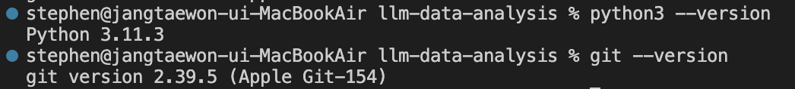
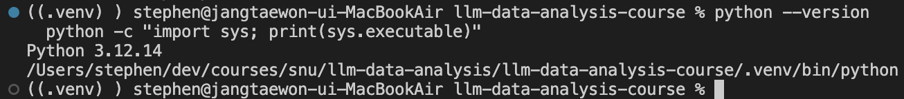
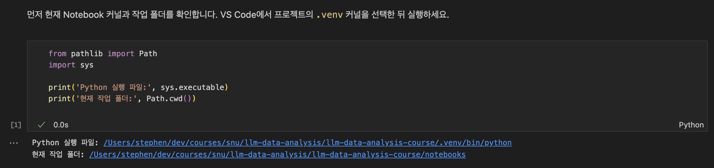
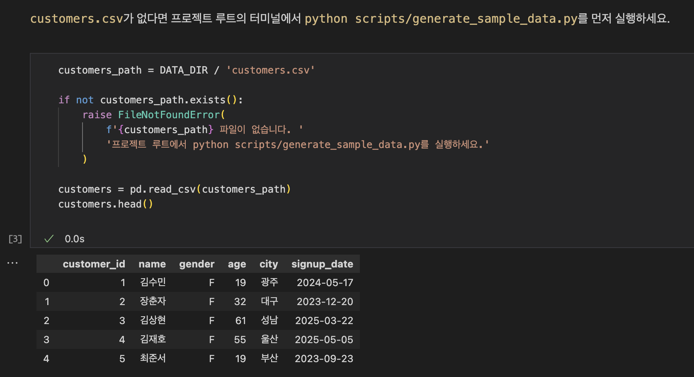
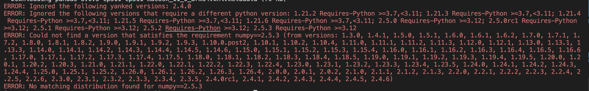
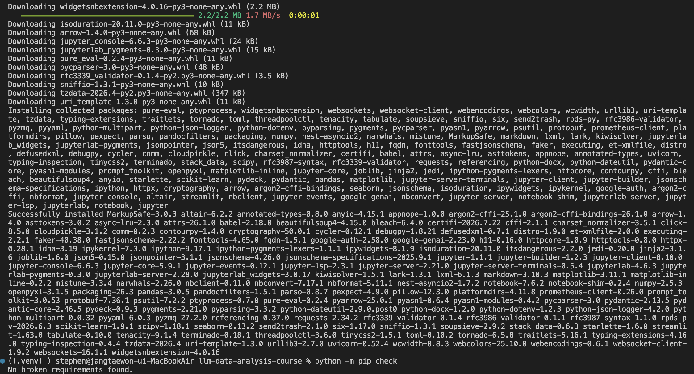
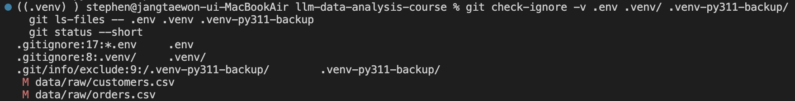

# Chapter 02 제출 답안. VS Code에서 시작하는 데이터 분석 환경

> 최종 파일은 개인 GitHub 저장소의 `chapter02/chapter02.md`로 저장하는 것을 권장합니다.

## 0. 제출 정보

이름: 장태원  
GitHub ID: pmsky1  
개인 저장소: `llm-data-analysis-study`  
작성일: 2026-09-16  
운영체제: macOS

### 최종 제출 URL

```text
https://github.com/pmsky1/llm-data-analysis-study/blob/main/chapter02/chapter02.md
```

---

## 1. Python과 Git 환경 확인

### 실행 내용

```text
python --version 또는 py --version
git --version
```

- macOS에서 실제 실행한 명령

```bash
python3 --version
git --version
```

### 실행 결과

```text
Python 3.11.3
git version 2.39.5 (Apple Git-154)
```

### Evidence



### 결과 관찰

버전과 실행 가능 여부를 사실 위주로 작성하세요.

- Python 3.11.3과 Git 2.39.5 버전이 정상 출력됨

### 나의 해석과 판단

현재 환경이 수업 실습에 적합한지 판단하고 이유를 작성하세요.

- 기본 도구는 실행 가능하지만 패키지 호환성은 별도 확인이 필요함

### 업무·분석적 의미

프로젝트 시작 전에 버전과 도구 상태를 확인하는 이유를 작성하세요.

- 실습 전 도구 상태를 확인하고 오류 발생 시 버전 비교에 활용할 수 있음

### 한계와 추가 확인 사항

아직 확인하지 못한 항목을 작성하세요.

- 버전 출력만으로 패키지 설치나 Notebook 실행까지 보장할 수는 없음

---

## 2. 저장소와 `.venv` 준비

### 수행 내용

- [x] 공식 Public 저장소 clone
- [x] 프로젝트 루트 확인
- [x] `.venv` 생성
- [x] `.venv` 활성화
- [x] `requirements.txt` 설치

### 핵심 실행 결과

```text
현재 프로젝트 경로: /Users/stephen/dev/courses/snu/llm-data-analysis/llm-data-analysis-course
터미널 Python 실행 파일: /Users/stephen/dev/courses/snu/llm-data-analysis/llm-data-analysis-course/.venv/bin/python
가상환경 활성화 여부: (.venv) 표시와 실제 Python 경로 확인함
패키지 설치 결과: Python 3.12.14 환경에서 Successfully installed 확인함
의존성 검사 결과: No broken requirements found.
```

### Evidence



### 결과 관찰

현재 `python`이 어떤 실행 파일을 가리키는지 작성하세요.

- Python 3.12.14가 프로젝트의 .venv에서 실행됨
- 패키지 설치 성공 후 pip check에서 의존성 문제 없음 확인함

### 나의 해석과 판단

시스템 Python과 프로젝트 `.venv`를 분리하는 것이 왜 필요한지 자신의 말로 작성하세요.

- 다른 프로젝트의 패키지와 섞이지 않도록 가상환경을 사용함

### 업무·분석적 의미

다른 사람이 같은 프로젝트를 재실행할 때 가상환경이 주는 이점을 작성하세요.

- Python 버전과 패키지 목록을 남기면 같은 환경을 다시 준비하기 쉬움

### 한계와 추가 확인 사항

회사/기관 PC 정책, Python 버전 차이 등 현재 환경의 제약을 작성하세요.

- 패키지가 설치되어도 실제 코드 실행은 별도 확인이 필요함

---

## 3. VS Code 인터프리터와 Jupyter 커널 연결

### 확인 결과

```text
VS Code Python 인터프리터: ./llm-data-analysis-course/.venv/bin/python (Python 3.12.14)
Notebook sys.executable: /Users/stephen/dev/courses/snu/llm-data-analysis/llm-data-analysis-course/.venv/bin/python
Notebook Path.cwd(): /Users/stephen/dev/courses/snu/llm-data-analysis/llm-data-analysis-course/notebooks
```

### Evidence



### 결과 관찰

터미널 Python과 Notebook Python이 같은 `.venv`인지 작성하세요.

- VS Code와 Notebook을 프로젝트 .venv로 맞추고 터미널과 같은 Python 경로 확인함
- Notebook 작업 폴더는 notebooks로 표시됨

### 나의 해석과 판단

둘이 다를 경우 어떤 문제가 발생할 수 있는지 작성하세요.

- 서로 다른 Python을 사용하면 설치한 패키지를 찾지 못할 수 있음

### 업무·분석적 의미

`ModuleNotFoundError` 같은 환경 오류를 줄이는 데 어떤 도움이 되는지 작성하세요.

- 패키지를 설치한 환경에서 코드를 실행하도록 맞추면 환경 차이로 인한 오류를 줄일 수 있음

### 한계와 추가 확인 사항

커널 이름만 보고 판단하면 안 되는 이유 등 추가 확인 사항을 작성하세요.

- 같은 이름의 .venv가 있을 수 있어 실제 실행 파일 경로도 확인함

---

## 4. 샘플 데이터와 Notebook 실행 검증

### 확인 결과

```text
DATA_DIR 존재 여부: True
customers.csv 존재 여부: 파일 검사 통과 후 정상 로드됨
customers.shape: (150, 6)
주요 컬럼: customer_id, name, gender, age, city, signup_date
```

### Evidence



### 결과 관찰

`customers.head()`, shape, 컬럼 결과에서 직접 확인한 사실을 작성하세요.

- 샘플 CSV 4개를 생성하고 customers.csv를 정상 로드함
- head()에서 첫 5행, shape에서 150행·6열 확인함
- info()에서 모든 컬럼이 150 non-null이며 정수형 2개와 문자열형 4개로 확인됨

### 나의 해석과 판단

이 단계까지 성공했다면 어떤 구성 요소가 정상 연결되었다고 판단할 수 있는지 작성하세요.

- 가상환경과 Notebook 커널, 패키지, CSV 경로가 연결되어 데이터를 읽을 수 있는 상태로 판단함

### 업무·분석적 의미

분석 전에 최소 스모크 테스트를 하는 이유를 작성하세요.

- 분석 전에 데이터 로드를 시험하면 환경과 경로 문제를 미리 찾을 수 있음

### 한계와 추가 확인 사항

현재는 환경 연결만 확인했으며 데이터 품질은 아직 검증하지 않았다는 점을 작성하세요.

- 데이터 로드와 기본 구조만 확인했으며 중복이나 값의 정확성은 검증하지 않음

---

## 5. 오류 해결 기록

실습 중 오류가 있었다면 작성합니다. 오류가 없었다면 `해당 없음`이라고 적습니다.

### 오류 메시지

```text
2.5.3 Requires-Python >=3.12
ERROR: No matching distribution found for numpy==2.5.3
```

### 원인 후보

1. Python 버전이 NumPy 요구 조건보다 낮음
2. 설치에 사용한 Python 환경이 다를 가능성 있음
3. 다른 패키지와 의존성 충돌 가능성 있음

### 내가 확인한 순서

1. 현재 Python 3.11.3과 오류의 Python >=3.12 조건을 비교함
2. Python 3.12.14로 가상환경을 다시 만들고 실행 경로 확인함
3. 재설치 후 pip check와 Notebook import 성공 확인함

### 해결 방법

```text
기존 가상환경을 보관하고 Python 3.12.14로 새 가상환경을 생성함
requirements.txt 재설치 후 pip check와 Notebook import 성공함
```

### Evidence





### 나의 해석과 판단

왜 해당 원인이 가장 가능성이 높다고 판단했는지 작성하세요.

- 오류의 버전 조건과 재설치 결과를 통해 Python 버전 불일치가 원인으로 판단됨

### 한계와 추가 확인 사항

보안 정책 변경, 무분별한 삭제처럼 시도하지 않은 조치와 이유를 작성하세요.

- 기존 환경은 보존했으며 별도로 발생한 pyenv 초기화 오류 자체를 수정한 것은 아님

---

## 6. Secret 보호 확인

- [x] `.env`는 Git 추적 대상이 아닙니다.
- [x] 실제 API Key를 코드에 작성하지 않았습니다.
- [x] 캡처 화면에 Token/비밀번호가 없습니다.
- [x] `.venv`를 Git에 올리지 않습니다.

### Evidence

필요한 경우 `git status`, `.gitignore` 확인 화면을 첨부합니다.



- .env, .venv, 가상환경 백업이 Git에서 제외되고 추적되지 않음을 확인함

### 나의 해석과 판단

환경 파일과 비밀정보를 분리해야 하는 이유를 작성하세요.

- 키와 비밀번호는 코드와 분리하고 가상환경은 패키지 목록으로 관리해야 함
- Git 제외 설정만으로 코드 내부의 비밀정보까지 보호되는 것은 아님

---

## 7. Chapter 02 최종 회고

### 가장 중요했다고 생각한 환경 설정 1가지

```text
패키지를 설치한 Python과 Notebook에서 실행하는 Python을 같은 .venv로 맞추는 것임
```

### 그 이유

```text
터미널과 VS Code의 Python이 다를 수 있어 실제 실행 경로를 확인하는 것이 중요함
```

### 다음 Chapter에서 재사용할 환경 체크 3가지

1. Python 버전과 sys.executable이 사용할 프로젝트의 .venv인지 확인함
2. 필요한 패키지의 import와 pip check 결과 확인함
3. Path.cwd()와 데이터 경로를 확인하고 CSV가 읽히는지 확인함

### 현재 환경의 한계 또는 주의점

```text
새 터미널이나 Notebook에서는 가상환경과 커널을 다시 확인할 필요 있음
데이터가 읽히는 것과 데이터 품질이 좋은 것은 다름
```

---

## 최종 제출 체크

- [x] 핵심 Evidence 4~7장을 첨부했습니다.
- [x] 단순 캡처가 아니라 관찰과 판단을 작성했습니다.
- [x] Secret/개인정보가 없습니다.
- [ ] GitHub에서 이미지가 정상 표시됩니다.
- [ ] 개인 저장소에 `chapter02/chapter02.md`를 업로드했습니다.
- [ ] 저장소 URL이 아니라 최종 파일 URL을 제출합니다.
