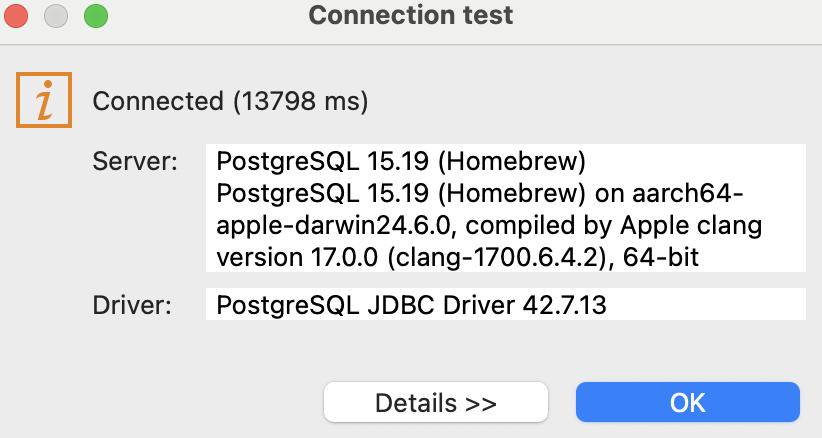
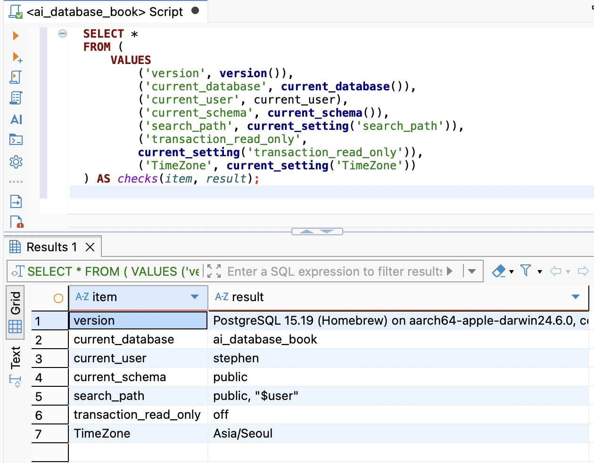
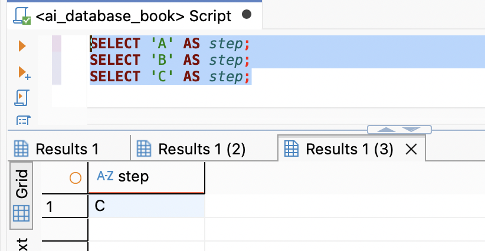
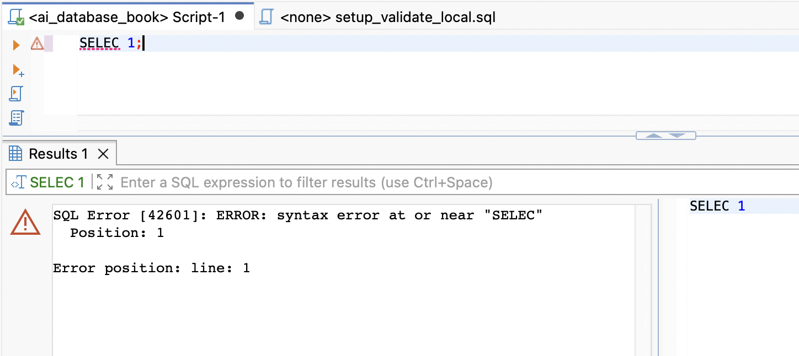

# Chapter 03 확장 실습 답안 템플릿

> **과제:** PostgreSQL과 DBeaver로 실습 환경 검증하기  
> **사용 방법:** 이 파일을 내려받아 본인의 GitHub 저장소에 `chapter03_answer.md`라는 이름으로 저장한 뒤 실습하면서 바로 작성합니다.  
> **제출 방법:** LMS에는 파일을 직접 업로드하지 않고, **본인 GitHub 저장소의 `chapter03_answer.md` 파일 URL**을 제출합니다.

---

## 제출 전 보안 주의

이 과제 파일과 캡처 화면에는 다음 정보를 올리지 않습니다.

```text
실제 PostgreSQL 비밀번호
전체 DB 접속 URL
API Key / Token
개인정보
공개할 필요가 없는 사내 서버 주소
```

LMS에서 제출자를 확인할 수 있으므로 공개 저장소의 답안 파일에 학번이나 실명을 반드시 적을 필요는 없습니다.

```text
GitHub 계정 또는 별칭: pmsky1
과제 작성일: 2026-09-23
사용한 AI 도구: ChatGPT
```

---

# 1. PostgreSQL과 DBeaver 환경 확인

## 1-1. 내 환경

| 항목 | 작성 내용 |
| --- | --- |
| 운영체제 | macOS |
| PostgreSQL 버전 | PostgreSQL 15.19 (Homebrew) |
| DBeaver 버전 | DBeaver Community 26.2.1 |
| Host | localhost |
| Port | 5432 |
| Database | ai_database_book |
| Username | stephen |

> 비밀번호는 기록하지 않습니다.

## 1-2. PostgreSQL과 DBeaver 역할 설명

```text
PostgreSQL은:
데이터를 저장하고 SQL을 실행하는 관계형 데이터베이스 서버

DBeaver는:
PostgreSQL 서버에 연결해 SQL을 작성하고 결과를 확인하는 데이터베이스 클라이언트

두 프로그램의 차이는:
PostgreSQL은 데이터를 보관하고 SQL을 실행하는 서버, DBeaver는 서버를 다루는 화면 도구
```

---

# 2. 연결 테스트와 첫 SQL

## 2-1. DBeaver 연결 결과

- [x] PostgreSQL 연결 유형 선택
- [x] Host 확인
- [x] Port 확인
- [x] Database 확인
- [x] Username 확인
- [x] Test Connection 성공

### 연결 성공 화면

권장 이미지 경로:

```text
assignments/chapter03/images/step02_connection.png
```



## 2-2. 첫 SQL 실행

```sql
SELECT 1 + 1 AS result;
```

실행 전 예상:

```text
수식 연산이 정상적으로 수행되어 2라는 결과값이 출력될 것으로 예상.
```

실제 결과:

```text
2
```

이 결과가 의미하는 것:

```text
PostgreSQL 서버가 연산 요청을 정상적으로 접수하고 처리할 수 있는 작동 상태임을 의미.
```

---

# 3. 현재 연결 위치를 SQL로 검증

다음 SQL을 실행합니다.

```sql
SELECT version();
SELECT current_database();
SELECT current_user;
SELECT current_schema();
SHOW search_path;
SHOW transaction_read_only;
SHOW TimeZone;
```

## 3-1. 결과 기록

| 확인 항목 | 실제 결과 | 내가 이해한 의미 |
| --- | --- | --- |
| `version()` | PostgreSQL 15.19 | 현재 접속한 PostgreSQL 서버의 버전 정보 |
| `current_database()` | ai_database_book | 현재 세션이 접속한 데이터베이스 이름 |
| `current_user` | stephen | 현재 PostgreSQL 세션에서 사용하는 계정 |
| `current_schema()` | public | `search_path`에서 실제로 사용할 수 있는 첫 번째 스키마 |
| `search_path` | public, "$user" | 스키마 이름을 생략했을 때 객체를 찾는 순서 |
| `transaction_read_only` | off | 현재 트랜잭션이 읽기 전용으로 강제되지 않은 상태이며 실제 변경 권한은 별도 확인 필요함 |
| `TimeZone` | Asia/Seoul | 현재 세션에서 날짜와 시각을 해석하고 표시하는 시간대 |

## 3-2. 반드시 설명할 것

### DBeaver 연결 이름과 `current_database()`는 왜 같은 개념이 아닌가요?

```text
DBeaver 연결 이름은 사용자가 정하는 별명이며 실제 접속한 데이터베이스 이름은 `current_database()`로 확인 필요함
```

### `current_schema()`와 `search_path`는 어떤 관계가 있나요?

```text
`search_path`는 스키마 이름을 생략했을 때 객체를 찾는 순서이며 `current_schema()`는 그중 실제로 사용할 수 있는 첫 번째 스키마
```

### `transaction_read_only = off`라는 결과만으로 모든 테이블을 만들 권한이 있다고 단정할 수 있나요?

```text
단정할 수 없음. 읽기 전용 트랜잭션이 아니라는 의미이며 데이터베이스와 스키마의 `CREATE` 권한은 별도 확인 필요함
```

## 3-3. 증거 화면

권장 경로:

```text
assignments/chapter03/images/step03_location_check.png
```



---

# 4. `ai_database_book` 데이터베이스 확인

## 4-1. 현재 데이터베이스

```sql
SELECT current_database();
```

실제 결과:

```text
ai_database_book
```

- [x] 결과가 `ai_database_book`이다.
- [ ] 다른 DB라면 올바른 연결로 전환했다.

## 4-2. 연결을 바꾼 뒤 다시 검증

```text
전환 전 데이터베이스: ai_database_book
전환 후 데이터베이스: 전환 불필요
전환 여부를 판단한 근거: `current_database()` 결과가 처음부터 ai_database_book으로 확인됨
```

### 화면에서 보이는 연결 이름만 믿지 않고 SQL을 다시 실행해야 하는 이유

```
DBeaver의 연결 이름은 별명이고 화면 선택만으로 실제 세션의 접속 위치를 보장할 수 없으므로 SQL로 다시 확인 필요함
```

---

# 5. SQL 실행 범위 실험

SQL Editor에 다음 세 문장을 입력합니다.

```sql
SELECT 'A' AS step;
SELECT 'B' AS step;
SELECT 'C' AS step;
```

## 5-1. 한 문장 실행

```text
내가 실행한 문장: SELECT 'A' AS step;
실제 결과: A
```

## 5-2. 선택 영역 실행

```text
선택한 문장: SELECT 'A' AS step;와 SELECT 'B' AS step;
실제 결과: A, B
```

## 5-3. 전체 스크립트 실행

```text
실제 결과: A, B, C
결과 탭 또는 실행 순서에서 관찰한 점: 각 문장의 결과 탭이 3개 생성됨
```

## 5-4. 결과 해석

```text
한 문장 실행과 전체 스크립트 실행의 차이: 한 문장은 커서가 있는 SQL만 실행하고 전체 스크립트는 문서 안의 모든 SQL을 실행함

변경 SQL에서 실행 범위를 잘못 선택하면 위험한 이유: 의도하지 않은 UPDATE나 DELETE까지 함께 실행되어 데이터가 변경될 수 있음
```

### 증거 화면

권장 경로:

```text
assignments/chapter03/images/step05_execution_scope.png
```



---

# 6. 제공된 환경 확인 SQL 실행

Public 저장소의 Chapter 03 파일을 사용합니다.

```text
code/chapter03/setup_check.sql
code/chapter03/setup_validate_local.sql
```

## 6-1. `setup_check.sql`

실행 결과에서 확인한 항목:

```text
PostgreSQL 버전: PostgreSQL 15.19
현재 DB: ai_database_book
현재 사용자: stephen
현재 스키마: public
search_path: public, "$user"
읽기 전용 여부: off
TimeZone: Asia/Seoul
1 + 1 결과: 2
public 스키마 존재 여부: t (True)
public USAGE 권한: t (True)
public CREATE 권한: t (True)
```

### 이 파일을 여러 번 실행해도 비교적 안전한 이유

```
조회와 환경·권한 확인 문장으로 구성되어 있고 테이블이나 업무 데이터를 생성·수정·삭제하는 문장이 없기 때문
```

## 6-2. `setup_validate_local.sql`

```text
실행 결과: NOTICE: Chapter 03 recommended local environment validation passed
PASS / FAIL: PASS
```

실패했다면 실패 항목: (해당 없음)

```text
해당 없음
```

그 실패가 실제 문제인지 환경 차이인지 판단한 근거: (성공)

```text
검증이 성공했으므로 실패 원인이나 환경 차이를 판단할 항목 없음
```

---

# 7. 안전한 오류 진단 실습

실제 오류가 있었다면 그 오류를 사용합니다. 오류가 없었다면 **데이터를 삭제하거나 서버를 강제로 중지하지 말고**, 안전한 SQL 문법 오류를 하나 만들어 관찰합니다.

예:

```sql
SELEC 1;
```

> 오류를 확인한 뒤 올바른 `SELECT 1;`로 복구합니다.

## 7-1. 오류 기록

```text
오류 메시지 핵심 문장: SQL Error [42601]: ERROR: syntax error at or near "SELEC", Position: 1

내가 먼저 생각한 원인 1: SELECT 명령어의 철자를 잘못 입력함

내가 먼저 생각한 원인 2: PostgreSQL에서 인식하지 못하는 SQL 명령어를 사용함

실제로 확인한 방법: 오류 위치와 입력한 SQL을 확인하고 올바른 SELECT 문과 비교함

실제 원인: SELECT에서 마지막 T가 빠진 문법 오류

수정한 내용: SELEC를 SELECT로 수정함
```



## 7-2. 수정 후 재검증

```sql
SELECT 1;
SELECT current_database();
```

```text
재검증 결과: SELECT 1은 1을 반환했고 current_database()는 ai_database_book을 반환함
```

## 7-3. 오류를 유형으로 분류

- [ ] 서버 실행 문제
- [ ] Host 문제
- [ ] Port 문제
- [ ] Database 문제
- [ ] Username/인증 문제
- [x] SQL 문법 문제
- [ ] 권한 문제
- [ ] 기타

선택 이유:

```text
오류 메시지가 SELEC 근처의 syntax error와 위치 1을 직접 가리켰고 SELECT로 고쳐야 하는 철자 오류를 확인했기 때문
```

---

# 8. AI를 오류 분석 보조 도구로 사용

## 8-1. AI에게 전달한 프롬프트

비밀번호·개인정보·전체 접속 URL은 제거하고 기록합니다.

```text
DBeaver에서 PostgreSQL에 연결한 뒤 SELEC 1;을 실행했더니 SQL Error [42601]: syntax error at or near "SELEC", Position: 1 오류가 발생했습니다. 가능한 원인, 먼저 확인할 항목, 안전한 수정 방법을 알려주세요.
```

## 8-2. AI 답변 검토

| AI가 제안한 확인 방법 | 실제로 확인했는가? | 결과 | 수용 / 수정 / 거절 |
| --- | --- | --- | --- |
| `SELEC`를 `SELECT`로 수정 | 확인함 | `SELECT 1;` 실행 결과 1 반환 | 수용 |
| 실행하려는 SQL 문장과 범위 확인 | 확인함 | 두 문장을 선택해 실행하니 결과 탭 2개 표시 | 수용 |
| 올바른 PostgreSQL 연결인지 확인 | 확인함 | `current_database()` 결과가 ai_database_book | 수용 |

### AI가 오류 원인을 너무 빨리 단정한 부분이 있었나요?

```text
없음, 오류 메시지가 SELEC와 위치 1을 직접 가리켜 철자 오류라는 설명이 실제 결과와 일치함
```

### 오류 메시지와 실제 환경 중 무엇을 확인해서 최종 판단했나요?

```text
오류 코드 42601과 SELEC 근처의 문법 오류라는 메시지를 먼저 확인하고 SELECT로 수정한 뒤 1이 반환되는지 검증함
```

### AI 활용에서 가장 유용했던 점

```text
오류 코드의 의미와 안전하게 확인할 순서를 빠르게 정리하는 데 도움이 됨
```

### AI 답변을 그대로 실행하지 않고 확인해야 하는 이유

```text
AI 설명은 실제 연결 상태나 실행 결과를 직접 확인할 수 없으므로 제안한 SQL을 실행해 결과를 검증해야 함
```

---

# 9. Chapter 01~02 개인 서비스와 연결

앞에서 선택한 개인 서비스가 PostgreSQL을 사용한다고 가정합니다.

```text
서비스 이름: 온라인 쇼핑몰 매출 분석 서비스

사용할 데이터베이스 이름 후보: shopping_mall_analytics

사용할 스키마 이름 후보: analytics

앞으로 만들고 싶은 테이블 후보 3개:
1. orders: 주문 한 건의 상태와 날짜를 저장
2. order_items: 주문에 포함된 상품별 수량과 단가를 저장
3. products: 상품명과 카테고리 정보를 저장
```

### 아직 SQL을 만들지 않고 이름과 역할만 정하는 이유

```text
테이블을 만들기 전에 이름과 역할을 정하면 필요한 데이터와 테이블 사이의 관계를 먼저 확인할 수 있기 때문
```

### Chapter 02에서 정리했던 한 행의 의미 중 수정할 부분이 있나요?

```text
수정할 부분 없음, customers.csv의 한 행은 고객 한 명을 나타내는 구조로 유지함
```

---

# 10. 초보자용 연결 가이드 작성

친구가 자신의 PC에서 같은 실습을 시작한다고 가정합니다. 아래 순서를 자신의 말로 작성합니다.

```text
1. PostgreSQL 서버가 실행되는지 확인하는 방법: macOS 터미널에서 brew services list로 상태를 확인하고 DBeaver의 Test Connection으로 접속을 시험함

2. DBeaver에서 PostgreSQL을 선택하고 Host, Port, Database, Username, 비밀번호를 입력한 뒤 Test Connection을 실행함

3. Host는 서버 위치, Port는 접속 통로 번호, Database는 사용할 데이터베이스, Username은 접속 계정을 의미함

4. 화면의 연결 이름만 보지 않고 SELECT current_database();를 실행해 ai_database_book이 반환되는지 확인함

5. SELECT current_database(); SELECT current_user; SELECT current_schema(); SHOW search_path;를 실행함

6. 한 문장 실행은 커서가 있는 SQL만 실행하지만 전체 스크립트 실행은 여러 문장을 순서대로 실행하므로 필요한 실행 범위를 먼저 확인해야 함

7. 공개된 비밀번호가 다른 사람의 무단 접속과 데이터 유출에 사용될 수 있기 때문
```

---

# 11. 최종 성찰

아래 문장은 반드시 본인의 말로 작성합니다.

```text
1. DBeaver와 PostgreSQL의 가장 중요한 차이는
   DBeaver는 데이터베이스에 연결하는 화면 도구이고 PostgreSQL은 데이터를 저장하고 SQL을 실행하는 서버라는 점이다

2. 내가 지금 어느 데이터베이스에 연결되어 있는지 확인할 때
   화면 이름만 보지 않고 current_database()를 실행해 실제 결과를 확인해야 한다

3. PostgreSQL 오류가 발생했을 때 가장 먼저 해야 할 일은
   설정을 바꾸기 전에 오류 메시지와 오류가 발생한 위치를 확인하는 것이다

4. AI를 오류 해결에 사용할 때 가장 중요한 것은
   AI의 설명을 그대로 믿지 않고 실제 환경에서 안전하게 실행해 검증하는 것이다
```

---

# 12. 제출 체크리스트

- [x] `chapter03_answer.md`의 빈 필수 항목을 작성했다.
- [x] PostgreSQL과 DBeaver의 역할 차이를 설명했다.
- [x] `current_database/current_user/current_schema/search_path`를 실제로 확인했다.
- [x] `ai_database_book` 연결 여부를 SQL로 검증했다.
- [x] SQL 실행 범위 세 가지를 비교했다.
- [x] `setup_check.sql`을 실행했다.
- [x] `setup_validate_local.sql` 결과를 확인했다.
- [x] 오류 원인을 먼저 스스로 추정한 뒤 AI를 사용했다.
- [x] AI 제안을 실제 환경에서 검증했다.
- [x] 핵심 캡처 3~4장만 골라 넣었다.
- [x] 캡처에 비밀번호·개인정보·전체 접속 URL이 없다.
- [ ] Markdown 이미지가 GitHub 웹 화면에서 실제로 보인다.
- [ ] 최종 답안 파일을 commit/push했다.

---

# 13. LMS 제출 URL

아래 형식의 **본인 GitHub 파일 URL**을 LMS에 제출합니다.

```text
https://github.com/<본인-GitHub-ID>/<본인-저장소>/blob/main/assignments/chapter03/chapter03_answer.md
```

내 제출 URL:

```text
https://github.com/pmsky1/llm-data-analysis-study/blob/main/chapter03/chapter03_answer.md
```

> 저장소 메인 URL, 교수자 템플릿 URL, Raw URL이 아니라 **작성 완료된 본인 `chapter03_answer.md` 파일 화면 URL**을 제출합니다.
